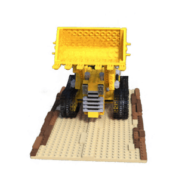

# pure-torch-ngp

This repository contains an unofficial implementation of

> "Instant Neural Graphics Primitives with a Multiresolution Hash Encoding" by
> Thomas Müller, Alex Evans, Christoph Schied, Alexander Keller @
> ACM Transactions on Graphics (SIGGRAPH 2022)

based strictly on PyTorch only functionality.

Currently, the tasks of learning Neural Radiance Fields and approximating Gigapixel images are available. The image below shows three novel viewpoints of a Lego model. The underlying NeRF model was trained on a synthetic dataset for about 2 mins using a _NVIDIA GeForce 3090 Ti_.


## NeRF Features

-   Support for multi-level hash encodings using a hybrid dense/sparse approach
-   Support for loading `transforms.json` scene file format
-   Support for alpha channels in RGBA input images
-   Support for training with dynamic noise backgrounds to encourage zero density learning
-   Added functionality to render scene setup
-   Added functionality to render novel viewpoints
-   Added volume rasterization and export
-   Added (unfinished) script to raytrace exported volume

## Blender Features

-   Automatically generate camera views for scene
-   Export scene to `transforms.json` for NeRF training

## Installation (using pinned dependencies)

Create a virtual env, clone the repo and install the dependencies

```shell
git clone https://github.com/cheind/pure-torch-ngp.git

cd pure-torch-ngp
python -m venv .venv
source .venv/bin/activate
```

For pinned dependencies (Python 3.9) execute

```
pip install pip-tools
pip-sync requirements.txt dev-requirements.txt
```

Otherwise try

```
pip install -r requirements.in
```

## Training

```
python -m torchngp.apps.nerf.train data=suzanne
```

[Hydra](https://hydra.cc/docs/intro/) is used for configuration management. The configuration files are stored in `cfgs/`. A folder per run in created in `outputs/` to store intermediate results and model weights.

## Render

To render images from a spherical coordinate trajectory execute

```shell
python -m torchngp.apps.nerf.render \
    +ckpt=<path/to/model.pth> \
    poses.n_poses=10 \
    output.grid=False \
    output.transparent=False
```

## More results



## Performance considerations

This implementation is roughly an order of magnitude slower than the original implementation. That is, it takes a minute what takes the original implementation only a few seconds. In additiona, we miss an integrated real-time viewer.
