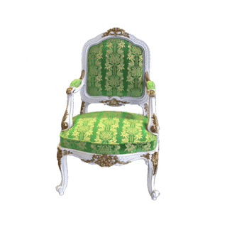
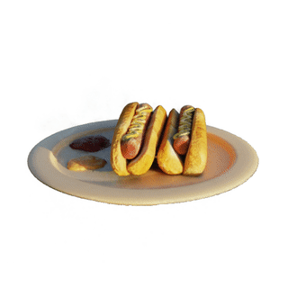

# pure-torch-ngp

This repository provides an unofficial implementation of

> "Instant Neural Graphics Primitives with a Multiresolution Hash Encoding" by
> Thomas Müller, Alex Evans, Christoph Schied, Alexander Keller @
> ACM Transactions on Graphics (SIGGRAPH 2022)

based on pure PyTorch functionality.

Currently, the tasks of learning Neural Radiance Fields and approximating Gigapixel images are available. The image below shows three novel viewpoints of a synthetic Lego model. The underlying NeRF model was trained on 100 images for about 2 mins using a NVIDIA GeForce 3090 Ti.


## NeRF Features

-   Multi-Level hash encodings using a hybrid dense/sparse approach
-   Training with dynamic noise backgrounds to encourage zero density learning for scenes with transparency
-   Occupancy grid acceleration structure to speed up ray marching
-   Generation of `Alpha`, `RGB` and `Depth` maps
-   Model export, volume rasterization and scene setup rendering

## Blender Synth Gen Features

This repository comes with Scripts to facilitate the generation of synthetic scenes through Blender. In particular the scripts perform the following tasks

-   Automatically generate camera views for scene
-   Export scene to `transforms.json` for NeRF training

## Installation (using pinned dependencies)

Create a virtual env, clone the repo and install the dependencies

```shell
git clone https://github.com/cheind/pure-torch-ngp.git

cd pure-torch-ngp
python -m venv .venv
source .venv/bin/activate
```

For pinned dependencies (Python 3.9) execute

```
pip install pip-tools
pip-sync requirements.txt dev-requirements.txt
```

Otherwise try

```
pip install -r requirements.in
```

## Training

```
python -m torchngp.apps.nerf.train +data=suzanne
```

[Hydra](https://hydra.cc/docs/intro/) is used for configuration management. The configuration files are stored in `cfgs/`. A folder per run in created in `outputs/` to store intermediate results and model weights.

## Render

To render images from a spherical coordinate trajectory execute

```shell
python -m torchngp.apps.nerf.render \
    ckpt=<path/to/model.pth> \
    poses.n_poses=60 \
    as_grid=False \
    rgba_transparent=False \
    depth_dynamic_range=True
```

## More results

### RGBA



### Depth maps


## Performance considerations

This implementation is roughly an order of magnitude slower than the original implementation. That is, it takes a minute what takes the original implementation only a few seconds. Furthermore, the PSNR values achieved lag behind those of the original work (e.g LEGO 35dB vs. 28dB using this implementation).
